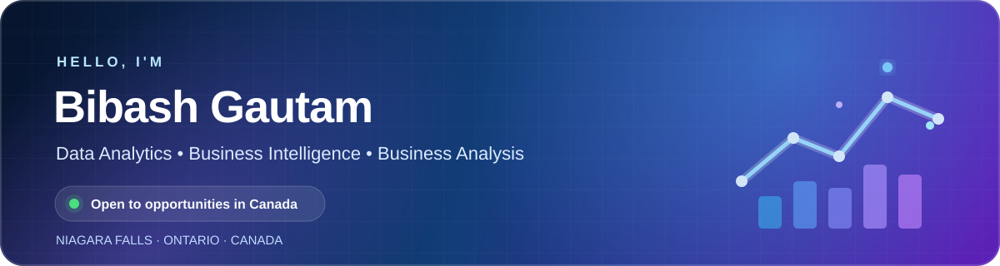

  

  
  
  
  

## 👋 About Me

I am pursuing a **Master of Data Analytics** at the **University of Niagara Falls Canada**. I combine analytics training with prior front-end and UI development experience to turn data into clear insights, useful dashboards, and practical recommendations.

<table>
  <tr>
    <td width="33%" align="center">
      <strong>🎓 MDA Student</strong> 
      Graduate studies in progress
    </td>
    <td width="33%" align="center">
      <strong>📊 Analytics &amp; BI</strong> 
      Data to decision-ready insight
    </td>
    <td width="33%" align="center">
      <strong>💻 Software Background</strong> 
      Development and Agile delivery
    </td>
  </tr>
</table>

- Building hands-on projects in data analysis, business intelligence, and visualization
- Comfortable working with Python, SQL, Excel, Power BI, Tableau, and Streamlit
- Experienced with React, JavaScript, REST APIs, Git, and collaborative Agile workflows
- Open to entry-level Data Analyst, BI Analyst, Business Analyst, and related opportunities in Canada

## 🧰 Core Toolkit

### Data & Analysis

  
  
  
  
  
  

### BI & Visualization

  
  
  
  
  

### Development & Delivery

  
  
  
  
  
  

**Analytics methods:** Exploratory data analysis · Data cleaning · Hypothesis testing · Regression · Classification · Clustering

**Workflow:** REST APIs · Git and GitHub · Agile collaboration

## 🚀 Featured Projects

### 🌿 [Air Quality Analytics Dashboard](https://github.com/BIbash09/Air_Quality_Group_7)

> Cleans the UCI Air Quality dataset, handles missing-value markers, calculates summary metrics, and visualizes pollutant trends, distributions, and correlations.

**Built with:** `Python` · `Pandas` · `Streamlit` · `Matplotlib` · `Seaborn`

[View repository →](https://github.com/BIbash09/Air_Quality_Group_7)

---

### 📈 [Data Analyst Portfolio](https://github.com/BIbash09/Bibash_portfolio)

> A responsive portfolio presenting analytics skills, experience, education, and case studies in a recruiter-friendly format.

**Built with:** `React` · `Vite` · `Framer Motion` · `CSS`

[View repository →](https://github.com/BIbash09/Bibash_portfolio)

---

### 🛒 [React E-Commerce Interface](https://github.com/BIbash09/ReactEcommerce)

> A component-based, responsive e-commerce interface with a modern development and build workflow.

**Built with:** `React` · `JavaScript` · `Vite` · `CSS`

[View repository →](https://github.com/BIbash09/ReactEcommerce)

## 🎓 Education

- **Master of Data Analytics** — University of Niagara Falls Canada *(in progress)*
- **Bachelor of Computer Applications** — Tribhuvan University, Nepal

## 🎯 Current Focus

I am strengthening my portfolio through practical analytics projects and preparing for junior analyst roles where I can combine data, business understanding, clear communication, and technical problem-solving.

---

  <strong>Open to analytics opportunities and project collaboration.</strong>

  <a href="https://www.linkedin.com/in/bibash-gautam/">Connect on LinkedIn</a>
  &nbsp;•&nbsp;
  <a href="https://github.com/BIbash09?tab=repositories">Explore my repositories</a>

